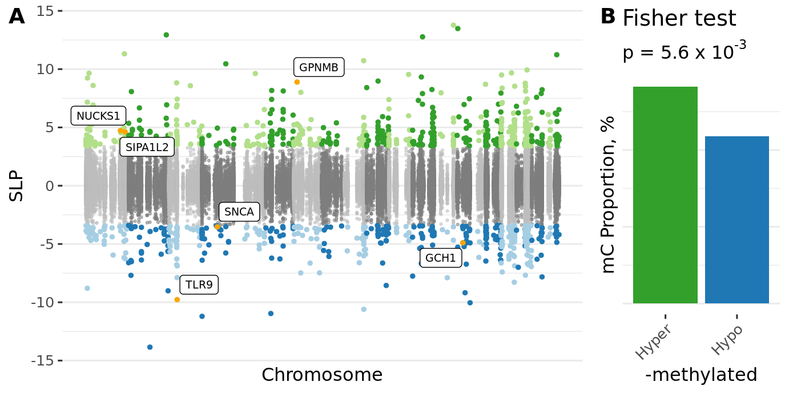

<!-- # (c)  Juozas Gordevičius -->

```{r, include=FALSE}
require(broom)
require(knitr)
source("../code/common.R")
```

# Olfactory bulb

```{r}
ofbx <- fread("../Brain_OFB_Padlock_CGonly/www/m6_Brain_OFB_Padlock_CGonly.csv")
ofbd <- readRDS("../Brain_OFB_Padlock_CGonly/www/m6_methylation.RDS")
```

```{r, include=TRUE, results='asis'}
n <- nrow(ofbx)
glue("- Number of loci {n}")
t <- ofbd$key[, table(Group)]
glue("- Number of PD cases: {t[2]} and controls: {t[1]}")
n <- ofbx[, sum(adj.P.Val < 0.05, na.rm=TRUE)]
glue("- Number of significant loci {n}")
n <- ofbx[adj.P.Val < 0.05, length(unique(Gene))]
glue("- Number of genes affected {n}")
```


Dominant direction of methylation

```{r, include=TRUE}
t <-
	ofbx[, list(
						Significant = ifelse(adj.P.Val < 0.05, "Significant", "NS"), 
					 	Direction = ifelse(logFC < 0, "Hypo-M", "Hyper-M")
					 )] %>%
	.[, table(Significant, Direction)] %>%
	.[c("NS", "Significant"), c("Hypo-M", "Hyper-M")]

# Show the table
knitr::kable(t) %>%
kable_styling(bootstrap_options = c("hover"),
							full_width = FALSE)

# Show fisher test result
t %>% fisher.test %>% 
tidy() %>%
kable() %>%
kable_styling(bootstrap_options = c("hover"))
```

```{r}
url <- "../Brain_OFB_Padlock_CGonly/www/m6_Brain_OFB_Padlock_CGonly.csv"
stopifnot(file.exists(url))
```

- **[Additional File 4](`r url`) DNA methylation changes in the olfactory bulb of PD patients relative to controls.**


```{r, include=TRUE, fig.cap="**Figure S5. DNA methylation changes in olfactory bulb of PD patients and controls.**"}

```


# Prefrontal cortex neurons (primary cohort)

```{r}
pfcx <- fread("../Brain_PFCRep_Padlock_withGLU/www/m6_Brain_PFCRep_Padlock_withGLU.csv")
pfcd <- readRDS("../Brain_PFCRep_Padlock_withGLU/www/m6_methylation.RDS")
```

```{r, include=TRUE, results='asis'}
n <- nrow(pfcx[Type == "CG"])
glue("- Number of CpG loci {n}")
n <- nrow(pfcx[Type != "CG"])
glue("- Number of CpH loci {n}")
t <- pfcd$key[, table(Group)]
glue("- Number of PD cases: {t[2]} and controls: {t[1]}")
n <- pfcx[, sum(adj.P.Val < 0.05, na.rm=TRUE)]
glue("- Number of significant loci {n}")
n <- pfcx[adj.P.Val < 0.05, length(unique(Gene))]
glue("- Number of genes affected {n}")
```


Dominant direction of methylation

```{r, include=TRUE}
t <-
	pfcx[, list(
						Significant = ifelse(adj.P.Val < 0.05, "Significant", "NS"), 
					 	Direction = ifelse(logFC < 0, "Hypo-M", "Hyper-M")
					 )] %>%
	.[, table(Significant, Direction)] %>%
	.[c("NS", "Significant"), c("Hypo-M", "Hyper-M")]

# Show the table
knitr::kable(t) %>%
kable_styling(bootstrap_options = c("hover"),
							full_width = FALSE)

# Show fisher test result
t %>% fisher.test %>% 
tidy() %>%
kable() %>%
kable_styling(bootstrap_options = c("hover"))
```

```{r}
url <- "../Brain_PFCRep_Padlock_withGLU_Braak/www/m6_Brain_PFCRep_Padlock_withGLU_Braak.csv"
stopifnot(file.exists(url))
```

- **[Additional File 5](`r url`) DNA methylation changes in the prefrontal cortex neurons of PD patients relative to controls, primary cohort**

```{r, include=TRUE, fig.cap="**Figure S6. DNA methylation changes in prefrontal cortex neurons of PD patients and controls.**"}
knitr::include_graphics(
	"../Brain_PFCRep_Padlock_withGLU/index_files/figure-html/unnamed-chunk-32-1.png")
```


## Prefrontal cortex neurons (replication cohort)

```{r}
pfc2x <- fread("../Brain_PFC_Padlock_CGonly/www/m6_Brain_PFC_Padlock_CGonly.csv")
pfc2d <- readRDS("../Brain_PFC_Padlock_CGonly/www/m6_methylation.RDS")
```


```{r, include=TRUE, results='asis'}
n <- nrow(pfc2x)
glue("- Number of loci {n}")
t <- pfc2d$key[, table(Group)]
glue("- Number of PD cases: {t[2]} and controls: {t[1]}")
n <- pfc2x[, sum(adj.P.Val < 0.05, na.rm=TRUE)]
glue("- Number of significant loci {n}")
n <- pfc2x[adj.P.Val < 0.05, length(unique(Gene))]
glue("- Number of genes affected {n}")
```


Dominant direction of methylation

```{r, include=TRUE}
t <-
	pfc2x[, list(
						Significant = ifelse(adj.P.Val < 0.05, "Significant", "NS"), 
					 	Direction = ifelse(logFC < 0, "Hypo-M", "Hyper-M")
					 )] %>%
	.[, table(Significant, Direction)] %>%
	.[c("NS", "Significant"), c("Hypo-M", "Hyper-M")]

# Show the table
knitr::kable(t) %>%
kable_styling(bootstrap_options = c("hover"),
							full_width = FALSE)

# Show fisher test result
t %>% fisher.test %>% 
tidy() %>%
kable() %>%
kable_styling(bootstrap_options = c("hover"))
```


