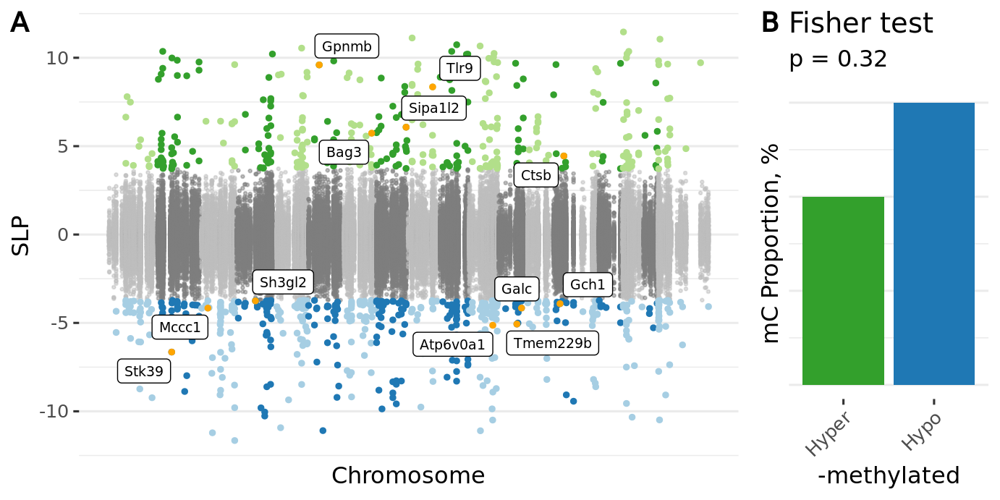

<!-- # (c)  Juozas Gordevičius -->

```{r, include=FALSE}
require(broom)
require(cowplot)
require("ggrepel")
source("../code/common.R")
source("../code/pformat.R")

# GWAS genes
geneList <- c("GBA","NUCKS1","SLC41A1","SIPA1L2","TMEM163","CCNT2","STK39","CHMP2B","MCCC1","TMEM175","DGKQ","FAM200B","CD38","FAM47E","SNCA","HLA-DRB6","HLA-DQA1","KLHL7","NUPL2","GPNMB","MICU3","BAG3","DLG2","MIR4697","LRRK2","OGFOD2","GCH1","TMEM229B","VPS13C","ZNF646","KAT8","ARHGAP27","CRHR1","SPPL2C","MAPT","STH","KANSL1","SYT4","LSM7","DDRGK1","ITPKB","IL1R2","SCN3A","SATB1","NCKIPSD","CDC71","ALAS1","TLR9","DNAH1","BAP1","PHF7","NISCH","STAB1","ITIH3","ITIH4","ANK2","CAMK2D","ELOVL7","ZNF184","CTSB","SORBS3","PDLIM2","C8orf58","BIN3","SH3GL2","FAM171A1","GALC","COQ7","TOX3","ATP6V0A1","PSMC3IP","TUBG2")

# Convert GWAS genes from human into mouse
gmap <- fread("../etc/padlock_genes_human2mouse.csv") %>% 
  .[, list(V1, V2)]
setnames(gmap, gmap[1,] %>% as.character)
gmap <- gmap[-1,]
geneList <- gmap[HGNC_hg19 %in% geneList, MGI_mm10]

```

```{r}
cpx <- fread("../Mice_CecalPatch_Padlock/www/m6_Mice_CecalPatch_Padlock.csv")
dssx <- fread("../Mice_DSS_Padlock/www/m6_Mice_DSS_Padlock.csv")
apx <- fread("../Appendix_PDvsControls_Padlock/www/m6_Appendix_PDvsControls_Padlock.csv")
```

# DSS

```{r, include=TRUE, results='asis'}
n <- nrow(dssx)
glue("- Number of loci {n}")

# In WT
colP <- "P.GTwt_DSS - GTwt_Water"
colB <- "B.GTwt_DSS - GTwt_Water"
n <- dssx[, sum(p.adjust(get(colP), "fdr") < 0.05, na.rm=TRUE)]
glue("- Number of significant loci in WT {n}")
n <- dssx[p.adjust(get(colP), "fdr") < 0.05, length(unique(Gene))]
glue("- Number of affected genes in WT {n}")
value1 <- dssx[p.adjust(get(colP), "fdr") < 0.05, mean(abs(get(colB)), na.rm=TRUE)] %>%
  `*`(100) %>% round(digits=2)
value2 <- dssx[p.adjust(get(colP), "fdr") < 0.05, sum(p.adjust(get(colP), "fdr") < 0.05, na.rm=TRUE), Gene] %>% .[, mean(V1)] %>% 
  round(digits = 1)
glue("- {value2} differentially methylated sites per affected ALP gene with {value1}% average methylation change")


# In A30P
colP <- "P.GTtg_DSS - GTtg_Water"
colB <- "B.GTtg_DSS - GTtg_Water"
n <- dssx[, sum(p.adjust(get(colP), "fdr") < 0.05, na.rm=TRUE)]
glue("- Number of significant loci in A30P {n}")
n <- dssx[p.adjust(get(colP), "fdr") < 0.05, length(unique(Gene))]
glue("- Number of affected genes in A30P {n}")
value1 <- dssx[p.adjust(get(colP), "fdr") < 0.05, mean(abs(get(colB)), na.rm=TRUE)] %>%
  `*`(100) %>% round(digits=2)
value2 <- dssx[p.adjust(get(colP), "fdr") < 0.05, sum(p.adjust(get(colP), "fdr") < 0.05, na.rm=TRUE), Gene] %>% .[, mean(V1)] %>% 
  round(digits = 1)
glue("- {value2} differentially methylated sites per affected ALP gene with {value1}% average methylation change")
```

Dominant direction of methylation in WT

```{r, include=TRUE}
colP <- "P.GTwt_DSS - GTwt_Water"
colC <- "C.GTwt_DSS - GTwt_Water"
t <- 
	dssx[, table(ifelse(p.adjust(get(colP), "fdr") < 0.05, "Significant", "NS"),
							 ifelse(get(colC) > 0, "Hyper-M", "Hypo-M"))] %>%
	.[c("NS", "Significant"), c("Hypo-M", "Hyper-M")]
f <- fisher.test(t)

# Show the table
knitr::kable(t) %>%
kable_styling(bootstrap_options = c("hover"),
							full_width = FALSE)

# Show fisher test result
t %>% fisher.test %>% 
broom::tidy() %>%
knitr::kable() %>%
kable_styling(bootstrap_options = c("hover"))
```

Dominant direction of methylation in A30P

```{r, include=TRUE}
colP <- "P.GTtg_DSS - GTtg_Water"
colC <- "C.GTtg_DSS - GTtg_Water"
t <- 
	dssx[, table(ifelse(p.adjust(get(colP), "fdr") < 0.05, "Significant", "NS"),
							 ifelse(get(colC) > 0, "Hyper-M", "Hypo-M"))] %>%
	.[c("NS", "Significant"), c("Hypo-M", "Hyper-M")]
f <- fisher.test(t)

# Show the table
knitr::kable(t) %>%
kable_styling(bootstrap_options = c("hover"),
							full_width = FALSE)

# Show fisher test result
t %>% fisher.test %>% 
broom::tidy() %>%
knitr::kable() %>%
kable_styling(bootstrap_options = c("hover"))
```

```{r}
theme_publication <- function(font = 7) {
  theme(
    text = element_text(family = "Helvetica", size = font, color = "black"),
    plot.title = element_text(size = font, color = "black"),

    panel.background = element_rect(fill = "transparent", colour = NA),
    panel.border = element_blank(),
    plot.background = element_rect(fill = "transparent", colour = NA),

    panel.grid.major = element_blank(),
    panel.grid.minor = element_blank(),

    axis.line = element_line(color = "black"),
    axis.text = element_text(size = font, color = "black"), 
    axis.ticks = element_line(size = 0.3, color = "black"),
    axis.title = element_text(size = font, color = "black"),

    # strip.background = element_rect(color = "white", fill = "white"),
    strip.text.x = element_text(size = font, color = "black"),
    strip.text.y = element_text(size = font, color = "black"),

    legend.background = element_rect(
      fill = alpha("white", 0),
      color = alpha("white", 0)
    ),
    legend.key = element_rect(color = NA, fill = NA),
    legend.key.size = unit(0.2, "cm"),    
    legend.text = element_text(size = font)
  )
}


foo <- function(snps, pvals) {
  snps[ which.min(pvals)]
}

foo2 <- function(N, SNP) {
  i <- which.max(N)
  return(SNP[i])
}

manhattanPlot <- function(fit) {
  getColorGroup <- function(Chr, Q, S) {
    Chr <- as.numeric(Chr)
    Q <- as.numeric(Q)
    S <- as.numeric(S)
    df <- data.frame(Chr, Q, S)
    apply(df, 1, function(I) {
      I <- as.list(I)
      if (I$Chr %% 2 == 0) {
        # Darker colors
        if (I$Q > 0.05) {
          "dark grey"
        } else {
          ifelse(I$S > 0, "dark positive", "dark negative")
        }
      } else {
        # Brighter colors
        if (I$Q > 0.05) {
          "light grey"
        } else {
          ifelse(I$S > 0, "light positive", "light negative")
        }
      }
    }) %>% unlist
  }

  fit[ log10(P) < -20, P := 1e-20]
  effects <- 
    fit[ Gene %in% geneList & Q < 0.05, ] %>% 
      # count how many times each gene is negative of positive
      .[, list(.N, SNP = foo(SNP, P), P = min(P)), by=list(Gene, sign(FC))] %>%
      # select the sign which has more representation
      .[, list(SNP=foo2(N, SNP)), Gene] %>%
      .[, Label := TRUE] %>% 
      merge(fit, ., by=c("Gene", "SNP"), all.x=TRUE)
  effects[is.na(Label), Label := FALSE]
  # effects[Label == TRUE]

  # Format the input data
  effects <- effects %>%
    # Fix chromosome name 
    .[, Chr := gsub("chr", "", Chr) ] %>% 
    # Give chromosomes numbers
    .[, ChrNo :=  Chr %>% gsub("X", "23", .) %>% gsub("Y", "24", .) %>% as.numeric]  %>%
    # Make sure SNP is numeric
    .[, SNP := as.numeric(SNP)] %>%
    setkey(ChrNo, SNP)

  # Prepare plot data
  effects <- effects[!is.na(Q)]
  # Points that will be painted grey
  greyIds <- effects[Q > 0.05, ] %>% .[ID %in% sample(ID, .N*0.05, prob=-log10(P)), ID]
  # Points that will be shown as significant
  coloredIds <- effects[Q <= 0.05, ID]
  pd <- effects %>% 
    # Compute chromosome size
    .[, list(ChrLen = max(SNP)), ChrNo] %>%
    # Calculate cumulative position of each chromosome
    .[, list(ChrNo, Tot = cumsum(ChrLen) - ChrLen)] %>%
    # Add this info to the initial dataset
    merge(effects, ., by=c("ChrNo")) %>%
    # Subsample 
    .[ ID %in% c(coloredIds, greyIds)] %>%      
    # Sort by ChrNo and position 
    .[ order(ChrNo, SNP), ] %>%
    # Compute position for each SNP on x axis
    .[, Loc := SNP + Tot] %>%
    # Get color group
    .[, Color := getColorGroup(ChrNo, !(Q < 0.05), FC) %>% as.factor ] %>%
    setkey(Loc)


  # Prepare the x axis
  pdAxis <- pd %>% 
    .[, list(center = ( max(Loc) + min(Loc) ) / 2 ), by=list(Chr, ChrNo)] %>%
    # omit some chromosomes
    .[, Chr := ifelse(ChrNo %in% seq(15, 21, 2), "", Chr)]


  # Prepare FDR thresholds
  pdThresholds <- pd[Q < 0.05, 
     list(
       Y = sign(max(FC)) * (-1) * log10(max(P)), 
       Label = "q < 0.05"),
     by = sign(FC)] %>%
    .[, X := pd[, min(Loc)]]

  # Prepare the core plot
  ggplot(pd, aes(x=Loc, y=-1 * sign(FC) * log10(P))) +
    # Show grey points
    geom_point(data = pd[!(Q <= 0.05)], aes(color=Color, shape=Color), 
      alpha=1, size=0.5) +
    # Show significant points
    geom_point(data = pd[Q <= 0.05], aes(color=Color, shape=Color), 
      alpha=1, size=1) + 
    # custom X axis:
    scale_x_continuous( label = pdAxis$Chr, breaks= pdAxis$center) +
    scale_y_continuous(limits = c(-20, 16)) +
    scale_color_manual( values = c("grey60", "#1f78b4", "#33a02c", 
                                   "grey80",   "#a6cee3","#b2df8a")) +
    scale_shape_manual("", values = c(1, 16, 16, 1, 16, 16)) + 
    guides(color = FALSE, shape = FALSE) +
    # Add labels
    geom_point(data=pd[Label == TRUE], color="orange", size=1.3) +
    geom_text_repel(data=pd[Label == TRUE & FC > 0], aes(label=Gene), 
      size=2.7, ylim=c(10, NA), segment.size = 0.25, force = 10) +
    geom_text_repel(data=pd[Label == TRUE & FC < 0], aes(label=Gene), 
      size=2.7, ylim=c(NA, -15), segment.size = 0.25, force = 10) +
    # geom_label_repel(data=pd[Label == TRUE], aes(label=Gene), 
    #   size=2.2, force=10, segment.size = 0.25) +    
    # Label the axes
    xlab("Chromosome") + 
    ylab("Signed log p") + 
    theme_publication()
}

plotEnrichment <- function(fit) {
  # Directional enrichment
  getEnrichment <- function(dat) {
    myt <- dat[, table(IsSignificant, sign(FC))]
    pd <- myt %>% as.data.table
    pd <- cbind(pd,
                myt %>% fisher.test %>% broom::tidy() %>% .[, c("estimate", "p.value")])
    pd <- pd %>% setnames(c("Significant", "Sign", "N", "OR", "P")) %>%
      .[, Significant := factor(Significant, levels = c(FALSE, TRUE), labels = c("p > 0.05", "p < 0.05"))] %>%
      .[, Sign := factor(Sign, levels = c(-1, 1), labels = c("Hypo-\nmethylation", "Hyper-\nmethylation"))] %>%
      .[order(Significant)] %>%
      .[, F := N / sum(N), Significant]
    pd
  }

  pd <-
    fit[, list(IsSignificant = Q < 0.05, FC)] %>%
    getEnrichment()
  pd[, OR := format(OR, digits=3)]
  pd[, P := format(P, digits=3, scientific=TRUE)]
  pd[, P := gsub("e", "~x~10^", P)]
  pd[, Label := paste0("~\"OR=\"~", OR, "~\", p=\"~", P)]
  ggplot(pd, aes(Sign, F,
               fill  = paste(Significant, Sign),
               color = paste(Significant, Sign))) +
  geom_bar(stat = "identity", position = position_dodge(width=0.5)) +
  geom_text(
    data = pd[Sign == "Hypo-\nmethylation" & Significant == "p < 0.05"],
    x = 1.5, y = 0.9, aes(label = Label),
    size = 2.2, color = "black", parse = TRUE) +
  ylab("Fraction, %") +
  # scale_fill_manual(values = c("blue", "green", "grey", "grey")) +
  scale_fill_manual("", values=c("#33a02c", "#1f78b4", "white", "white")) +
  scale_color_manual("", values=c("#33a02c", "#1f78b4", "grey60", "grey60")) +
  scale_y_continuous(labels = scales::percent_format(accuracy = 2), limits = c(0, 1)) +
  guides(fill = FALSE, color = FALSE) +
  ggtitle("DSS effect in:") +
  theme_publication() +
  theme(axis.title.x = element_blank())
}

```


```{r, include=TRUE, fig.height=7.2, fig.cap="**Figure S12. Manhattan plot demonstrating differential methylation in wild-type mice that experienced DSS-mediated gut inflammation. There were 397 genes in the ALP exhibiting differential methylation in wild-type mice that experienced DSS colitis, relative to wild-type mice that did not experience DSS colitis (1,104 sites at q < 0.05, robust linear regression). ALP genes implicated in both our study and PD risk by GWAS [23] (mapped to corresponding mouse genes) are labeled. SLP refers signed log p-value, with sign corresponding to the direction of DNA methylation change (hypermethylation, green or hypomethylation, blue).**"}

# Manhattan plot of DSSvsSal@wt
conA <- "GTwt_DSS - GTwt_Water"
fit <- dssx[, list(ID, Chr, SNP, Gene, 
          P = get(glue("P.{conA}")), FC = get(glue("C.{conA}")))]
fit[, Q := p.adjust(P, "fdr")]
pA <- manhattanPlot(fit)
pAE <- plotEnrichment(fit)


# Manhattan plot of DSSvsSal@mt
conA <- "GTtg_DSS - GTtg_Water"
fit <- dssx[, list(ID, Chr, SNP, Gene, 
          P = get(glue("P.{conA}")), FC = get(glue("C.{conA}")))]
fit[, Q := p.adjust(P, "fdr")]
pB <- manhattanPlot(fit)
pBE <- plotEnrichment(fit)


# Manhattan plot of MTvsWT@water
conA <- "GTtg_Water - GTwt_Water"
fit <- dssx[, list(ID, Chr, SNP, Gene, 
          P = get(glue("P.{conA}")), FC = get(glue("C.{conA}")))]
fit[, Q := p.adjust(P, "fdr")]
pC <- manhattanPlot(fit)
pCE <- plotEnrichment(fit)


suppressWarnings(
  ggdraw() + 
    draw_plot(pA + ylab("Wild type,\nDSS-Water, SLP"), 
      x = 0, y = 0.7, width = 0.7, height = 0.3) + 
    draw_plot(pAE + ggtitle("Wild type,\nDSS-Water"), 
      x = 0.7, y = 0.7, width = 0.3, height = 0.3) + 
    draw_plot(pB + ylab("A30P,\nDSS-Water, SLP"), 
      x = 0, y = 0.4, width = 0.7, height = 0.3) + 
    draw_plot(pBE + ggtitle("A30P,\nDSS-Water"), 
      x = 0.7, y = 0.4, width = 0.3, height = 0.3) + 
    draw_plot(pC + ylab("Water\nA30P - Wild type, SLP"), 
      x = 0, y = 0.1, width = 0.7, height = 0.3) + 
    draw_plot(pCE + ggtitle("Water\nA30P - Wild type"), 
      x = 0.7, y = 0.1, width = 0.3, height = 0.3) +
    draw_plot_label(
      label = letters[1:3],
      size = 10,
      x = c(0, 0,    0),
      y = c(1, 0.7, 0.4)))


```

```{r}
url <- "../Mice_DSS_Padlock/www/m6_Mice_DSS_Padlock.csv"
stopifnot(file.exists(url))
```

- **[Additional file 15](`r url`) DNA methylation changes in the cecal patch in response to gut inflammation: wild-type and A30P $\alpha$-syn mice chronically treated with DSS or water.**


# Cecal patch


```{r, include=TRUE, results='asis'}
n <- nrow(cpx)
glue("- Number of loci {n}")
n <- cpx[, sum(adj.P.Val < 0.05, na.rm=TRUE)]
glue("- Number of significant loci {n}")
n <- cpx[adj.P.Val < 0.05, length(unique(Gene))]
glue("- Number of genes affected {n}")
value1 <- cpx[adj.P.Val < 0.05, mean(abs(BetaFC), na.rm=TRUE)] %>%
  `*`(100) %>% round(digits=2)
value2 <- cpx[adj.P.Val < 0.05, sum(adj.P.Val < 0.05, na.rm=TRUE), Gene] %>% .[, mean(V1)] %>% 
  round(digits = 1)
glue("- {value2} differentially methylated sites per affected ALP gene with {value1}% average methylation change")
```


```{r, include=TRUE, fig.cap="**Figure S14. Differential methylation of the ALP in the cecal patch of mice with a-syn aggregation. **"}

```

```{r}
url <- "../Mice_CecalPatch_Padlock/www/m6_Mice_CecalPatch_Padlock.csv"
stopifnot(file.exists(url))
```

- **[Additional file 16](`r url`) DNA methylation changes in the cecal patch induced by rAAV vector-mediated $\alpha$-syn aggregation in mice.**


# Correlation of gene enrichments in cecal patch and DSS mice


```{r}
# Compute enrichment of genes in mice data
computeORs <- function(dt) {
	require(doParallel)
	registerDoParallel(cores = parallel::detectCores())
  dt <- 
    foreach (gene = unique(dt$Gene), .combine = rbind) %dopar% {
      require(data.table)
      tryCatch({
        t <- dt[, table(Gene == gene, Significant == TRUE)]
        f <- fisher.test(t, alternative = "greater")
        data.table(OR = f$estimate, P = f$p.value, 
                   N=dt[Gene == gene & Significant == TRUE, .N], 
                   Gene = gene)    
      }, error = function(e) {
        message(e)
        data.table(OR = NA, P = NA, 
                   N = dt[Gene == gene & Significant == TRUE, .N], 
                   Gene = gene)
      })
    }
  dt
}

# touch()
ecp <- cache(foo=computeORs, fname="ecp.RDS",
             dt=cpx[, list(Gene, Significant = adj.P.Val < 0.05)])
setnames(ecp, c("OR", "P", "N"), paste0(c("OR.", "P.", "N."), "CP"))

myContrasts <- c(
  "GTwt_DSS - GTwt_Water",
  "GTtg_DSS - GTwt_Water",
  "GTtg_DSS - GTtg_Water",
  "GTtg_Water - GTwt_Water")

edss <- foreach( cont = myContrasts) %do% {
	colP <- paste0("P.", cont)
	# touch()
	e <- cache(foo=computeORs, fname=glue("edss_{cont}.RDS"),
	           dt = dssx[, list(Gene, 
	                            Significant = p.adjust(get(colP), "fdr") < 0.05)])
	setnames(e, c("OR", "P", "N"), paste0(c("OR.", "P.", "N."), cont))
	e
}
names(edss) <- myContrasts


dt <- foreach(cont = myContrasts, .combine=rbind) %do% {
	orname <- paste0("OR.", cont)
	nname <- paste0("N.", cont)
  X <- merge(ecp, edss[[cont]], by = "Gene")
  
  res <- 
  	X %>%
	  .[OR.CP > 0 & get(orname) > 0] %>%
	  .[, cor.test(log(OR.CP), log(get(orname)), method="kendall")] %>%
	  tidy

	overlap <- X[ N.CP > 0 & get(nname) > 0, .N]
	res %>% 
	mutate(overlap = overlap) %>%
	mutate(Contrast = cont)
}

fwrite(dt, "ORs_CecalPatch_DSS.csv")	  
```


```{r, include=TRUE}
dt %>%
mutate(p_star = gtools::stars.pval(p.value)) %>%
mutate(p_star = texPstars(p_star)) %>%
kable %>% 
kable_styling(bootstrap_options="hover")
```

# Correlation of gene enrichments in mice and appendix

```{r}

# compute odds ratios 
# touch()
eapx <- cache(foo=computeORs, fname="eapx.RDS",
              dt=apx[, list(Gene, Significant = adj.P.Val < 0.05)])
eapx <- merge(eapx, gmap, by.x = "Gene", by.y = "HGNC_hg19")
eapx <- eapx[, list(OR, P, N, Gene = MGI_mm10)]
eapx <- eapx[!duplicated(Gene)]

# Correlate to mice DSS
dt <- 
  foreach(cont = myContrasts, .combine=rbind) %do% {
		orname <- paste0("OR.", cont)
		nname <- paste0("N.", cont)
	  X <- merge(eapx, edss[[cont]], by = "Gene")

		res <- 
			X %>%
		  .[OR > 0 & get(orname) > 0] %>%
		  .[, cor.test(log(OR), log(get(orname)), method="kendall")] %>%
		  tidy

		overlap <- X[ N > 0 & get(nname) > 0, .N]
		res %>% 
		mutate(overlap = overlap) %>%
		mutate(Contrast = cont)
  }

# Corerlate to mice CP
X <- merge(eapx, ecp, by = "Gene")
overlap = X[ N > 0 & N.CP > 0, .N]
dt2 <- 
   X[OR > 0 & OR.CP > 0] %>%
    .[, cor.test(log(OR), log(OR.CP), method="kendall")] %>% 
    tidy() %>%
    mutate(overlap = overlap) %>%
    mutate(Contrast = "Cecal patch")


dt <- rbind(dt, dt2)
rm(dt2)
fwrite(dt, file = "ORs_Appendix_Mice.csv")
```

```{r, include=TRUE}
dt %>%
mutate(p_star = gtools::stars.pval(p.value)) %>%
mutate(p_star = texPstars(p_star)) %>%
kable %>% 
kable_styling(bootstrap_options="hover")
```

# Enrichment of ALP pathways

```{r}
pathways_mouse <- readRDS("../Discover_Pathways/mousePathways.RDS")
pathways_human <- readRDS("../Discover_Pathways/humanPathways.RDS")

# Table that stores the count of the number of DMCs in each gene
dt <- apx[, list(APX = sum(adj.P.Val < 0.05, na.rm=TRUE)), Gene]
dt <- merge(dt, gmap, by.x = "Gene", by.y = "HGNC_hg19") 
dt <- dt[, list(Gene_Mouse = MGI_mm10, Gene_Human=Gene, APX)]
dt <- merge(
  dt,
  cpx[, list(CecalPatch = sum(adj.P.Val < 0.05, na.rm=TRUE)), Gene], 
  by.x = "Gene_Mouse", by.y = "Gene")
foreach (contrast = myContrasts) %do% {
  colP <- glue("P.{contrast}")
  colC <- glue("C.{contrast}")

  dt <- 
    dssx[, list(C = sum(p.adjust(get(colP), "fdr") < 0.05, na.rm=TRUE)), Gene] %>%
    setnames(., "C", contrast) %>%
    merge(dt, ., by.x = "Gene_Mouse", by.y = "Gene")
  return(NULL)
}

```


```{r}
# Take the genes that have more than 1 DMCs in both appendix and mouse dataset and test which pathways are enriched.
res <- 
  foreach( p = pathways_human, .combine = rbind) %do% {
    genes <- p$genes

    res1 <- dt[, table(APX > 1 & CecalPatch > 1, Gene_Human %in% genes)] %>%
            fisher.test %>%
            broom::tidy() %>% 
            select(estimate, p.value, conf.low, conf.high) %>%
            setDT %>%
            .[, Test := sprintf('rAAV \u03B1-syn')] %>%
            .[, Pathway := p$name]
    res2 <- dt[, table(APX > 1 & `GTtg_DSS - GTtg_Water` > 1, Gene_Human %in% genes)] %>%
            fisher.test %>%
            broom::tidy() %>% 
            select(estimate, p.value, conf.low, conf.high) %>%
            setDT %>%
            .[, Test := "A30P_DSS - A30P_Water"] %>%
            .[, Pathway := p$name]
    res3 <- dt[, table(APX > 1 & `GTwt_DSS - GTwt_Water` > 1, Gene_Human %in% genes)] %>%
            fisher.test %>%
            broom::tidy() %>% 
            select(estimate, p.value, conf.low, conf.high) %>%
            setDT %>%
            .[, Test := "WT_DSS - WT_Water"] %>%
            .[, Pathway := p$name]
    res4 <- dt[, table(APX > 1 & `GTtg_DSS - GTwt_Water` > 1, Gene_Human %in% genes)] %>%
            fisher.test %>%
            broom::tidy() %>% 
            select(estimate, p.value, conf.low, conf.high) %>%
            setDT %>%
            .[, Test := "A30P_DSS - WT_Water"] %>%
            .[, Pathway := p$name]
           
    res5 <- dt[, table(APX > 1 & `GTtg_Water - GTwt_Water` > 1, Gene_Human %in% genes)] %>%
            fisher.test %>%
            broom::tidy() %>% 
            select(estimate, p.value, conf.low, conf.high) %>%
            setDT %>%
            .[, Test := "A30P_Water - WT_Water"] %>%
            .[, Pathway := p$name]
    rbindlist(list(res1, res2, res3, res4, res5))
  }

```

```{r}
# Take the genes that have more than 1 DMC in both cecal patch experiment and other DSS contrast and test which pathways are enriched.
res2 <-
  foreach( p = pathways_mouse, .combine = rbind) %do% {
    genes <- p$genes

    res2 <- dt[, table(CecalPatch > 1 & `GTtg_DSS - GTtg_Water` > 1, Gene_Mouse %in% genes)] %>%
            fisher.test %>%
            broom::tidy() %>% 
            select(estimate, p.value, conf.low, conf.high) %>%
            setDT %>%
            .[, Test := sprintf("A30P_DSS - A30P_Water")] %>%
            .[, Pathway := p$name]
    res3 <- dt[, table(CecalPatch > 1 & `GTwt_DSS - GTwt_Water` > 1, Gene_Mouse %in% genes)] %>%
            fisher.test %>%
            broom::tidy() %>% 
            select(estimate, p.value, conf.low, conf.high) %>%
            setDT %>%
            .[, Test := sprintf("WT_DSS - WT_Water")] %>%
            .[, Pathway := p$name]
    res4 <- dt[, table(CecalPatch > 1 & `GTtg_DSS - GTwt_Water` > 1, Gene_Mouse %in% genes)] %>%
            fisher.test %>%
            broom::tidy() %>% 
            select(estimate, p.value, conf.low, conf.high) %>%
            setDT %>%
            .[, Test := sprintf("A30P_DSS - WT_Water")] %>%
            .[, Pathway := p$name]
           
    res5 <- dt[, table(CecalPatch > 1 & `GTtg_Water - GTwt_Water` > 1, Gene_Mouse %in% genes)] %>%
            fisher.test %>%
            broom::tidy() %>% 
            select(estimate, p.value, conf.low, conf.high) %>%
            setDT %>%
            .[, Test := sprintf("A30P_Water - WT_Water")] %>%
            .[, Pathway := p$name]
    rbindlist(list(res2, res3, res4, res5))
  }

```


```{r}
res[, Study := "PD appendix vs mice studies"]
res2[, Study := sprintf("rAAV-\u03B1-syn vs\nDSS study")]
pd <- rbind(res, res2)

p1 <- ggplot(pd, aes(Pathway, log(estimate), color = p.value < 0.05, shape = Test)) + 
      geom_jitter(size = 3, width = 0.2) + 
      geom_hline(yintercept = 0) + 
      ylab("OR, log") + 
      facet_wrap(~ Study) + 
      scale_shape_discrete("") + 
      scale_color_manual("p", values = c("grey30", "red"), labels = c("> 0.05", "< 0.05")) + 
      theme_bw(base_size = 14) + 
      theme(
        axis.title.x = element_blank(),
        axis.text.x = element_text(angle = 45, hjust = 1))

```

```{r, include=TRUE, fig.cap="**Figure S15. ALP pathway changes in the PD appendix compared to the mouse studies.**"}
p1
```

Overlap of findings in appendix, A30P and DSS mice at gene level and their enrichment with ALP pathways. Only pathways positively enriched with p < 0.05 are shown.


```{r}
classifyGene <- function(logfc, p, q, qth = 0.05, retNAforNoDMC = FALSE) {
  nhyper <- sum(q < qth & logfc > 0, na.rm=TRUE)
  nhypo <- sum(q < qth & logfc < 0, na.rm=TRUE)
  if (nhyper > nhypo) {
    return("Hyper-")
  } else if (nhyper < nhypo) {
    return("Hypo-")
  } else {
    meanfc <- weighted.mean(logfc, -log(p), na.rm=TRUE)
    hasdmc <- sum(q < qth, na.rm=TRUE) > 0
    if (hasdmc <= 0 & retNAforNoDMC == TRUE)
      return("NS")
    if (sign(meanfc) > 0) 
      return("Hyper-")
    else 
      return("Hypo-")
  }
}


A <- 
  apx[, 
    list(
      Nsig = sum(adj.P.Val < 0.05, na.rm=TRUE), 
      Direction = classifyGene(logFC, P.Value, adj.P.Val, 0.05, retNAforNoDMC=TRUE)), 
    Gene] %>%
  .[, HGNC_hg19 := Gene] %>%
  setkey(HGNC_hg19) %>%
  .[!duplicated(HGNC_hg19)] %>%
  .[, list(HGNC_hg19, `Appendix` = Direction)]

B <- 
  cpx[, 
    list(
      Nsig = sum(adj.P.Val < 0.05, na.rm=TRUE), 
      Direction = classifyGene(logFC, P.Value, adj.P.Val, 0.05, retNAforNoDMC=TRUE)
    ), 
    Gene
  ] %>%
  merge(gmap, by.x = "Gene", by.y = "MGI_mm10") %>%
  setkey(HGNC_hg19) %>%
  .[!duplicated(HGNC_hg19)] %>%
  .[, list(HGNC_hg19, `rAAV a-syn` = Direction)]

C <- 
  dssx[, 
    list(Gene, logFC = `C.GTtg_Water - GTwt_Water`, P.Value = `P.GTtg_Water - GTwt_Water`)] %>%
    .[, adj.P.Val := p.adjust(P.Value, "fdr")] %>%
    .[, list(Nsig = sum(adj.P.Val < 0.05, na.rm=TRUE), Direction = classifyGene(logFC, P.Value, adj.P.Val, 0.05, retNAforNoDMC=TRUE)), Gene] %>%
  merge(gmap, by.x = "Gene", by.y = "MGI_mm10") %>%
  setkey(HGNC_hg19) %>%
  .[!duplicated(HGNC_hg19)] %>%
  .[, list(HGNC_hg19, `A30P_Water - WT_Water` = Direction)]


D <- 
  dssx[, list(Gene, logFC = `C.GTtg_DSS - GTtg_Water`, P.Value = `P.GTtg_DSS - GTtg_Water`)] %>%
    .[, adj.P.Val := p.adjust(P.Value, "fdr")] %>%
    .[, list(Nsig = sum(adj.P.Val < 0.05, na.rm=TRUE), Direction = classifyGene(logFC, P.Value, adj.P.Val, 0.05, retNAforNoDMC=TRUE)), Gene] %>%
  merge(gmap, by.x = "Gene", by.y = "MGI_mm10") %>%
  setkey(HGNC_hg19) %>%
  .[!duplicated(HGNC_hg19)] %>%
  .[, list(HGNC_hg19, `A30P_DSS - A30P_Water` = Direction)]

E <- 
  dssx[, list(Gene, logFC = `C.GTwt_DSS - GTwt_Water`, P.Value = `P.GTwt_DSS - GTwt_Water`)] %>%
    .[, adj.P.Val := p.adjust(P.Value, "fdr")] %>%
    .[, list(Nsig = sum(adj.P.Val < 0.05, na.rm=TRUE), Direction = classifyGene(logFC, P.Value, adj.P.Val, 0.05, retNAforNoDMC=TRUE)), Gene] %>%
  merge(gmap, by.x = "Gene", by.y = "MGI_mm10") %>%
  setkey(HGNC_hg19) %>%
  .[!duplicated(HGNC_hg19)] %>%
  .[, list(HGNC_hg19, `WT_DSS - WT_Water` = Direction)]

dt <- merge(A, B) %>% merge(C) %>% merge(D) %>% merge(E)
fwrite(dt, "Direction_Genes_Apendix_Mouse.csv")
```

Hyper-modified genes

```{r, include=TRUE}
dtHyper <- 
  dt %>%
    .[, list(
            Appendix = Appendix == "Hyper-",
            `a-syn` = `rAAV a-syn` == "Hyper-" | `A30P_Water - WT_Water` == "Hyper-",
            `DSS` = `A30P_DSS - A30P_Water` == "Hyper-" | `WT_DSS - WT_Water` == "Hyper-"
        ), 
        HGNC_hg19]

dtHyper %>% 
  select(-HGNC_hg19) %>% 
  vennCounts

res <- 
  foreach( dss = 0:1, .combine = rbind ) %:%
  foreach( asyn = 0:1, .combine = rbind ) %:%
  foreach( app = 0:1, .combine = rbind ) %:%
  foreach( i = 1:length(pathways_human), .combine = rbind) %do% {
    tryCatch({
      dtHyper[, table(HGNC_hg19 %in% pathways_human[[i]]$genes, Appendix == app & `a-syn` == asyn & DSS == dss)] %>% 
      fisher.test %>%
      broom::tidy() %>% 
      mutate(Pathway = pathways_human[[i]]$name) %>%
      mutate(
        Apx = app, 
        `a-syn` = asyn, 
        DSS = dss) %>%
      setDT
    }, error = function(e) {
      return(NULL)
    })
  }
res[p.value < 0.05 & estimate > 1, list(estimate, p.value, Pathway, Apx, `a-syn`, DSS)] %>%
kable %>% 
kable_styling(bootstrap_options="hover")
```


Hypo-modified genes

```{r, include=TRUE}
dtHypo <- 
  dt %>%
    .[, list(
            Appendix = Appendix == "Hypo-",
            `a-syn` = `rAAV a-syn` == "Hypo-" | `A30P_Water - WT_Water` == "Hypo-",
            `DSS` = `A30P_DSS - A30P_Water` == "Hypo-" | `WT_DSS - WT_Water` == "Hypo-"
        ), 
        HGNC_hg19]

dtHypo %>% 
  select(-HGNC_hg19) %>% 
  vennCounts

res <- 
  foreach( dss = 0:1, .combine = rbind ) %:%
  foreach( asyn = 0:1, .combine = rbind ) %:%
  foreach( app = 0:1, .combine = rbind ) %:%
  foreach( i = 1:length(pathways_human), .combine = rbind) %do% {
    tryCatch({
      dtHypo[, table(HGNC_hg19 %in% pathways_human[[i]]$genes, Appendix == app & `a-syn` == asyn & DSS == dss)] %>% 
      fisher.test %>%
      broom::tidy() %>% 
      mutate(Pathway = pathways_human[[i]]$name) %>%
      mutate(
        Apx = app, 
        `a-syn` = asyn, 
        DSS = dss) %>%
      setDT
    }, error = function(e) {
      return(NULL)
    })
  }
res[p.value < 0.05 & estimate > 1, list(estimate, p.value, Pathway, Apx, `a-syn`, DSS)] %>%
kable %>% 
kable_styling(bootstrap_options="hover")
```


```{r}
dt[, `Selective autophagy` := HGNC_hg19 %in% pathways_human[[1]]$genes]
dt[, `Macroautophagy` := HGNC_hg19 %in% pathways_human[[2]]$genes]
dt[, `Lysosomes` := HGNC_hg19 %in% pathways_human[[3]]$genes]
dt[, `Chaperone-mediated autophagy` := HGNC_hg19 %in% pathways_human[[4]]$genes]
dt[, `Autophagy` := HGNC_hg19 %in% pathways_human[[5]]$genes]

fwrite(dt, "www/Direction_Genes_Apendix_Mouse.csv")
url <- "./www/Direction_Genes_Apendix_Mouse.csv"
stopifnot(file.exists(url))
```

- **[Additional file 17](`r url`) Dominant direction of methylation in each ALP gene in appendix and mouse cecal patch.**
