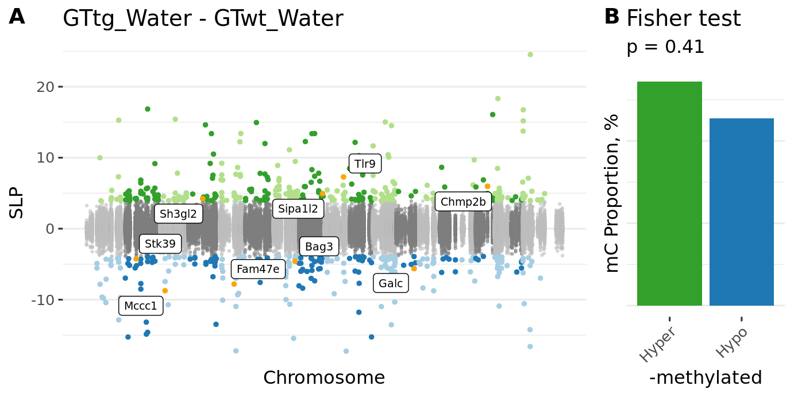

<!-- # (c)  Juozas Gordevičius -->

```{r, include=FALSE}
source("../code/common.R")

gmap <- fread("../etc/padlock_genes_human2mouse.csv") %>%
  select(V1, V2)
gmap[1, ] %>% as.character %>% setnames(gmap, .)
gmap <- gmap[-1,]
```

```{r}
cpx <- fread("../Mice_CecalPatch_Padlock/www/m6_Mice_CecalPatch_Padlock.csv")
dssx <- fread("../Mice_DSS_Padlock/www/m6_Mice_DSS_Padlock.csv")
apx <- fread("../Appendix_PDvsControls_Padlock/www/m6_Appendix_PDvsControls_Padlock.csv")
```

# DSS

```{r, include=TRUE, results='asis'}
n <- nrow(dssx)
glue("- Number of loci {n}")

# In WT
colP <- "P.GTwt_DSS - GTwt_Water"
n <- dssx[, sum(p.adjust(get(colP), "fdr") < 0.05, na.rm=TRUE)]
glue("- Number of significant loci in WT {n}")
n <- dssx[p.adjust(get(colP), "fdr") < 0.05, length(unique(Gene))]
glue("- Number of affected genes in WT {n}")

# In A30P
colP <- "P.GTtg_DSS - GTtg_Water"
n <- dssx[, sum(p.adjust(get(colP), "fdr") < 0.05, na.rm=TRUE)]
glue("- Number of significant loci in A30P {n}")
n <- dssx[p.adjust(get(colP), "fdr") < 0.05, length(unique(Gene))]
glue("- Number of affected genes in A30P {n}")
```

Dominant direction of methylation in WT

```{r, include=TRUE}
colP <- "P.GTwt_DSS - GTwt_Water"
colC <- "C.GTwt_DSS - GTwt_Water"
t <- 
	dssx[, table(ifelse(p.adjust(get(colP), "fdr") < 0.05, "Significant", "NS"),
							 ifelse(get(colC) > 0, "Hyper-M", "Hypo-M"))] %>%
	.[c("NS", "Significant"), c("Hypo-M", "Hyper-M")]
f <- fisher.test(t)

# Show the table
knitr::kable(t) %>%
kable_styling(bootstrap_options = c("hover"),
							full_width = FALSE)

# Show fisher test result
t %>% fisher.test %>% 
broom::tidy() %>%
knitr::kable() %>%
kable_styling(bootstrap_options = c("hover"))
```

Dominant direction of methylation in A30P

```{r, include=TRUE}
colP <- "P.GTtg_DSS - GTtg_Water"
colC <- "C.GTtg_DSS - GTtg_Water"
t <- 
	dssx[, table(ifelse(p.adjust(get(colP), "fdr") < 0.05, "Significant", "NS"),
							 ifelse(get(colC) > 0, "Hyper-M", "Hypo-M"))] %>%
	.[c("NS", "Significant"), c("Hypo-M", "Hyper-M")]
f <- fisher.test(t)

# Show the table
knitr::kable(t) %>%
kable_styling(bootstrap_options = c("hover"),
							full_width = FALSE)

# Show fisher test result
t %>% fisher.test %>% 
broom::tidy() %>%
knitr::kable() %>%
kable_styling(bootstrap_options = c("hover"))
```

```{r}
url <- "../Mice_DSS_Padlock/www/m6_Mice_DSS_Padlock.csv"
stopifnot(file.exists(url))
```


```{r, include=TRUE, fig.cap="**Figure S12. Differential methylation of the ALP in the cecal patch of A30P α-syn mice.**"}

```

- **[Additional file 14](`r url`) DNA methylation changes in the cecal patch in response to gut inflammation: wild-type and A30P $\alpha$-syn mice chronically treated with DSS or water.**

